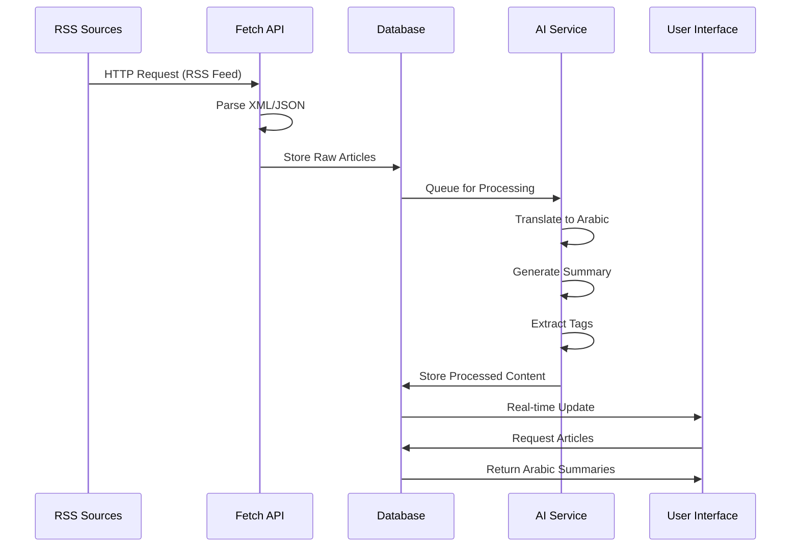

# System Architecture Overview

## 🏛️ **Executive Summary**

The Tech News Summarizer system is built on a modern, scalable architecture using Next.js 15 with the App Router. The system is designed to handle high-volume news processing, AI-powered summarization, and real-time content delivery to Arabic-speaking technology professionals.

---

## 🎯 **Architecture Goals**

### Primary Goals
- **Scalability**: Handle 1000+ articles daily with 10,000+ concurrent users
- **Performance**: Sub-200ms API response times
- **Reliability**: 99.5%+ system uptime
- **Maintainability**: Clean, well-documented codebase
- **Security**: Enterprise-grade security practices

### Secondary Goals
- **Extensibility**: Easy to add new features and integrations
- **Internationalization**: Ready for multi-language support
- **Accessibility**: WCAG 2.1 compliant
- **Developer Experience**: Modern tooling and workflows

---

## 🏗️ **High-Level Architecture**

```
┌─────────────────┐    ┌─────────────────┐    ┌─────────────────┐
│   News Sources  │    │   AI Services   │    │   User Clients  │
│                 │    │                 │    │                 │
│ • TechCrunch    │    │ • z-ai-web-dev  │    │ • Web Browser  │
│ • Wired         │    │ • Translation   │    │ • Mobile Web   │
│ • The Verge     │    │ • Summarization │    │ • Admin Panel  │
│ • Ars Technica  │    │ • Tagging       │    │                 │
│ • MIT Tech Rev  │    │                 │    │                 │
└─────────────────┘    └─────────────────┘    └─────────────────┘
         │                       │                       │
         │ RSS/HTTP              │ API                   │ HTTP/WebSocket
         ▼                       ▼                       ▼
┌─────────────────────────────────────────────────────────────────┐
│                    Application Layer                             │
│                                                                 │
│  ┌─────────────┐  ┌─────────────┐  ┌─────────────┐  ┌─────────┐ │
│  │   API       │  │   Web App   │  │   Admin     │  │   Socket│ │
│  │   Routes    │  │   Pages     │  │   Dashboard │  │   IO    │ │
│  │             │  │             │  │             │  │         │ │
│  │ • News     │  │ • Homepage  │  │ • Control   │  │ • Real-  │ │
│  │ • Automation│  │ • Search    │  │ • Logs      │  │   time   │ │
│  │ • Categories│  │ • Filters   │  │ • Stats     │  │ • Events │ │
│  │ • Tags      │  │ • Articles  │  │ • Monitor   │  │         │ │
│  │ • Sources   │  │             │  │             │  │         │ │
│  └─────────────┘  └─────────────┘  └─────────────┘  └─────────┘ │
└─────────────────────────────────────────────────────────────────┘
                              │
                              │ Database Queries
                              ▼
┌─────────────────────────────────────────────────────────────────┐
│                    Data Layer                                    │
│                                                                 │
│  ┌─────────────┐  ┌─────────────┐  ┌─────────────┐  ┌─────────┐ │
│  │   Database  │  │    Cache    │  │    Files    │  │   Logs  │ │
│  │             │  │             │  │             │  │         │ │
│  │ • SQLite    │  │ • Memory    │  │ • Uploads   │  │ • System │ │
│  │ • Prisma    │  │ • Redis     │  │ • Images    │  │ • App    │ │
│  │ • Models    │  │ • Sessions  │  │ • Assets    │  │ • Audit  │ │
│  │ • Relations │  │ • Response  │  │             │  │         │ │
│  │             │  │             │  │             │  │         │ │
│  └─────────────┘  └─────────────┘  └─────────────┘  └─────────┘ │
└─────────────────────────────────────────────────────────────────┘
```

---

## 📊 **Component Architecture**

### 1. Frontend Layer

#### Technology Stack
- **Framework**: Next.js 15 with App Router
- **Language**: TypeScript
- **Styling**: Tailwind CSS + shadcn/ui
- **State Management**: Zustand + TanStack Query
- **Icons**: Lucide React

#### Key Components
```
Frontend/
├── Layout Components
│   ├── Header/           # Site navigation
│   ├── Footer/           # Site footer
│   └── Sidebar/          # Navigation sidebar
├── Page Components
│   ├── Homepage/         # Main landing page
│   ├── AdminDashboard/   # Administration interface
│   └── ArticlePage/      # Individual article view
├── UI Components
│   ├── ArticleCard/      # Article display card
│   ├── SearchBar/        # Search functionality
│   ├── FilterPanel/      # Category/tag filtering
│   └── LoadingSpinner/   # Loading states
└── Shared Components
    ├── ErrorHandler/     # Error boundary
    ├── Notification/     # User notifications
    └── Modal/           # Modal dialogs
```

#### Data Flow
```
User Interaction → Component State → API Call → State Update → UI Re-render
```

### 2. Backend Layer

#### API Architecture
```
API Routes/
├── News Management
│   ├── GET /api/news           # Fetch articles
│   ├── POST /api/news/fetch     # Fetch from sources
│   ├── POST /api/news/summarize # AI summarization
│   └── POST /api/news/tag       # Auto-tagging
├── Content Management
│   ├── GET /api/categories     # Category CRUD
│   ├── GET /api/tags           # Tag management
│   └── GET /api/sources        # Source management
├── System Management
│   ├── POST /api/automation    # Control automation
│   └── GET /api/automation/logs # System logs
└── WebSocket Events
    ├── news:updated           # Real-time updates
    ├── system:status          # System status
    └── user:notification      # User notifications
```

#### Middleware Stack
```
Request → CORS → Authentication → Validation → Rate Limiting → Business Logic → Response
```

### 3. Data Layer

#### Database Schema
```
Core Models:
├── NewsSource           # RSS feed sources
├── Category             # Article categories
├── Tag                  # Article tags
├── NewsArticle          # Main article content
├── NewsSummary          # Arabic summaries
├── NewsTag              # Article-tag relationships
├── ProcessingLog        # System logging
└── UserPreferences      # User settings

Relationships:
NewsSource 1→N NewsArticle
Category 1→N NewsArticle
Tag N→N NewsArticle (through NewsTag)
NewsArticle 1→1 NewsSummary
```

#### Data Access Layer
```
Database/
├── Prisma Client        # ORM interface
├── Query Builders       # Complex query logic
├── Repository Pattern   # Data access abstraction
└── Connection Pooling   # Performance optimization
```

### 4. AI Integration Layer

#### z-ai-web-dev-sdk Integration
```
AI Services/
├── Translation Service
│   ├── English → Arabic
│   ├── Technical terms preservation
│   └── Style optimization
├── Summarization Service
│   ├── Content analysis
│   ├── Key point extraction
│   ├── Summary generation
│   └── Confidence scoring
└── Tagging Service
│   ├── Content analysis
│   ├── Keyword extraction
│   ├── Category prediction
│   └── Tag suggestions
```

---

## 🔄 **Data Flow Architecture**

### 1. News Processing Pipeline

```
RSS Feeds → Fetch API → Parse & Validate → Store in Database → 
AI Processing Queue → Translation → Summarization → Tagging → 
Final Storage → User Notification
```

#### Detailed Flow


### 2. User Interaction Flow

```
User Request → API Gateway → Authentication → 
Authorization → Business Logic → Data Access → 
Response Formatting → Cache Storage → User Response
```

### 3. Real-time Communication

```
Server Event → Socket.io → Broadcast → 
Client Receives → State Update → UI Refresh
```

---

## 🏛️ **System Design Patterns**

### 1. Repository Pattern
```typescript
// Abstract data access
interface NewsRepository {
  findById(id: string): Promise<NewsArticle | null>
  findAll(filters: NewsFilters): Promise<NewsArticle[]>
  create(data: CreateNewsDTO): Promise<NewsArticle>
  update(id: string, data: UpdateNewsDTO): Promise<NewsArticle>
}

// Implementation
class PrismaNewsRepository implements NewsRepository {
  async findById(id: string): Promise<NewsArticle | null> {
    return await db.newsArticle.findUnique({ where: { id } })
  }
  
  // ... other methods
}
```

### 2. Command Pattern for Automation
```typescript
interface AutomationCommand {
  execute(): Promise<AutomationResult>
}

class FetchNewsCommand implements AutomationCommand {
  async execute(): Promise<AutomationResult> {
    // Fetch news logic
    return { success: true, message: 'News fetched successfully' }
  }
}

class SummarizeNewsCommand implements AutomationCommand {
  async execute(): Promise<AutomationResult> {
    // Summarization logic
    return { success: true, message: 'News summarized successfully' }
  }
}
```

### 3. Observer Pattern for Real-time Updates
```typescript
class NewsEventManager {
  private observers: NewsObserver[] = []

  subscribe(observer: NewsObserver): void {
    this.observers.push(observer)
  }

  notify(event: NewsEvent): void {
    this.observers.forEach(observer => observer.update(event))
  }
}
```

---

## 🔒 **Security Architecture**

### 1. Authentication & Authorization
```
Security Layers:
├── Authentication
│   ├── NextAuth.js Integration
│   ├── JWT Tokens
│   └── Session Management
├── Authorization
│   ├── Role-Based Access Control
│   ├── Permission Checks
│   └── Route Protection
└── API Security
    ├── Rate Limiting
    ├── Input Validation
    └── CORS Configuration
```

### 2. Data Protection
```
Data Security:
├── Encryption
│   ├── Data at Rest (SQLite Encryption)
│   └── Data in Transit (HTTPS/TLS)
├── Validation
│   ├── Input Sanitization
│   ├── Schema Validation
│   └── Type Safety (TypeScript)
└── Privacy
    ├── GDPR Compliance
    ├── Data Minimization
    └── User Consent Management
```

### 3. API Security
```typescript
// Security middleware example
export async function securityMiddleware(req: NextRequest) {
  // Rate limiting
  const rateLimitResult = await checkRateLimit(req)
  if (!rateLimitResult.allowed) {
    return NextResponse.json({ error: 'Rate limit exceeded' }, { status: 429 })
  }

  // Input validation
  const validationResult = await validateInput(req)
  if (!validationResult.valid) {
    return NextResponse.json({ error: 'Invalid input' }, { status: 400 })
  }

  // CORS check
  const corsResult = await checkCORS(req)
  if (!corsResult.allowed) {
    return NextResponse.json({ error: 'CORS policy violation' }, { status: 403 })
  }
}
```

---

## ⚡ **Performance Architecture**

### 1. Caching Strategy
```
Caching Layers:
├── Application Cache
│   ├── Memory Cache (In-memory)
│   ├── Redis Cache (Distributed)
│   └── CDN Cache (Edge)
├── Database Cache
│   ├── Query Cache
│   ├── Connection Pool
│   └── Index Optimization
└── Browser Cache
    ├── Static Assets
    ├── API Responses
    └── Service Worker
```

### 2. Database Optimization
```typescript
// Optimized queries with indexing
export async function getNewsWithFilters(filters: NewsFilters) {
  return await db.newsArticle.findMany({
    where: {
      isProcessed: true,
      arabicSummary: { isNot: null },
      ...(filters.category && { category: { name: filters.category } }),
      ...(filters.search && {
        OR: [
          { title: { contains: filters.search, mode: 'insensitive' } },
          { summary: { contains: filters.search, mode: 'insensitive' } }
        ]
      })
    },
    include: {
      source: true,
      category: true,
      tags: { include: { tag: true } },
      arabicSummary: true
    },
    orderBy: { publishedAt: 'desc' },
    take: filters.limit || 20,
    skip: filters.offset || 0
  })
}
```

### 3. Frontend Performance
```
Optimization Techniques:
├── Code Splitting
│   ├── Route-based Splitting
│   ├── Component-based Splitting
│   └── Dynamic Imports
├── Image Optimization
│   ├── Next.js Image Component
│   ├── WebP Format
│   └── Lazy Loading
└── Bundle Optimization
    ├── Tree Shaking
    ├── Minification
    └── Compression
```

---

## 📈 **Scalability Architecture**

### 1. Horizontal Scaling
```
Scaling Strategy:
├── Application Layer
│   ├── Multiple Instances
│   ├── Load Balancer
│   └── Auto-scaling
├── Database Layer
│   ├── Read Replicas
│   ├── Database Sharding
│   └── Connection Pooling
└── Cache Layer
    ├── Distributed Cache
    ├── Cache Invalidation
    └── Cache Strategies
```

### 2. Microservices Ready Design
```
Service Boundaries:
├── News Service
│   ├── Article Management
│   ├── Source Management
│   └── Category Management
├── AI Service
│   ├── Translation
│   ├── Summarization
│   └── Tagging
├── User Service
│   ├── Authentication
│   ├── Authorization
│   └── Preferences
└── Analytics Service
    ├── Usage Tracking
    ├── Performance Metrics
    └── Business Intelligence
```

---

## 🚨 **Monitoring & Observability**

### 1. Logging Architecture
```
Logging Strategy:
├── Structured Logging
│   ├── JSON Format
│   ├── Correlation IDs
│   └── Log Levels
├── Centralized Logging
│   ├── Log Aggregation
│   ├── Log Retention
│   └── Log Analysis
└── Real-time Monitoring
    ├── Error Tracking
    ├── Performance Metrics
    └── System Health
```

### 2. Error Handling
```typescript
// Global error handler
export class AppError extends Error {
  public statusCode: number
  public isOperational: boolean

  constructor(message: string, statusCode: number) {
    super(message)
    this.statusCode = statusCode
    this.isOperational = true
    Error.captureStackTrace(this, this.constructor)
  }
}

// Error handling middleware
export function errorHandler(err: Error, req: NextRequest, res: NextResponse) {
  if (err instanceof AppError) {
    return NextResponse.json(
      { error: err.message },
      { status: err.statusCode }
    )
  }

  // Log unexpected errors
  console.error('Unexpected error:', err)
  
  return NextResponse.json(
    { error: 'Internal server error' },
    { status: 500 }
  )
}
```

---

## 🌐 **Deployment Architecture**

### 1. Environment Strategy
```
Environments:
├── Development
│   ├── Local Development
│   ├── Feature Branches
│   └── Pull Request Testing
├── Staging
│   ├── Production-like Environment
│   ├── Integration Testing
│   └── User Acceptance Testing
└── Production
    ├── Live Environment
    ├── Blue-Green Deployment
    └── Canary Releases
```

### 2. Infrastructure as Code
```yaml
# Example deployment configuration
version: '3.8'
services:
  app:
    build: .
    ports:
      - "3000:3000"
    environment:
      - NODE_ENV=production
      - DATABASE_URL=${DATABASE_URL}
    depends_on:
      - db
    restart: unless-stopped

  db:
    image: sqlite:latest
    volumes:
      - ./data:/data
    restart: unless-stopped
```

---

## 🔧 **Development Architecture**

### 1. Development Workflow
```
Development Process:
├── Local Development
│   ├── Hot Module Replacement
│   ├── Development Database
│   └── Development Tools
├── Code Quality
│   ├── ESLint
│   ├── TypeScript
│   └── Prettier
├── Testing
│   ├── Unit Tests
│   ├── Integration Tests
│   └── E2E Tests
└── CI/CD
    ├── Automated Testing
    ├── Build Pipeline
    └── Deployment Pipeline
```

### 2. Tooling Configuration
```json
{
  "scripts": {
    "dev": "next dev",
    "build": "next build",
    "start": "next start",
    "lint": "next lint",
    "type-check": "tsc --noEmit",
    "test": "jest",
    "test:watch": "jest --watch",
    "test:e2e": "playwright test",
    "db:push": "prisma db push",
    "db:studio": "prisma studio"
  }
}
```

---

## 📋 **Architecture Decision Records (ADRs)**

### ADR-001: Technology Stack Selection
**Status**: Accepted  
**Date**: 2025-06-20  
**Decision**: Use Next.js 15 with App Router, TypeScript, and Prisma ORM

### ADR-002: Database Choice
**Status**: Accepted  
**Date**: 2025-06-20  
**Decision**: Use SQLite for development, PostgreSQL for production

### ADR-003: AI Integration
**Status**: Accepted  
**Date**: 2025-06-20  
**Decision**: Use z-ai-web-dev-sdk for AI-powered features

### ADR-004: Authentication Strategy
**Status**: Pending  
**Date**: 2025-06-20  
**Decision**: Implement NextAuth.js for future authentication needs

---

## 🎯 **Future Architecture Considerations**

### 1. Microservices Migration
- Service boundary identification
- Inter-service communication
- Distributed transactions
- Service discovery

### 2. Event-Driven Architecture
- Event sourcing
- CQRS pattern
- Event streaming
- Real-time processing

### 3. Advanced AI Features
- Custom model training
- Sentiment analysis
- Content personalization
- Predictive analytics

### 4. Enterprise Features
- Multi-tenancy
- Advanced security
- Compliance features
- Integration platforms

---

**Last Updated**: 2025-06-20  
**Version**: 1.0.0  
**Maintainer**: Architecture Team